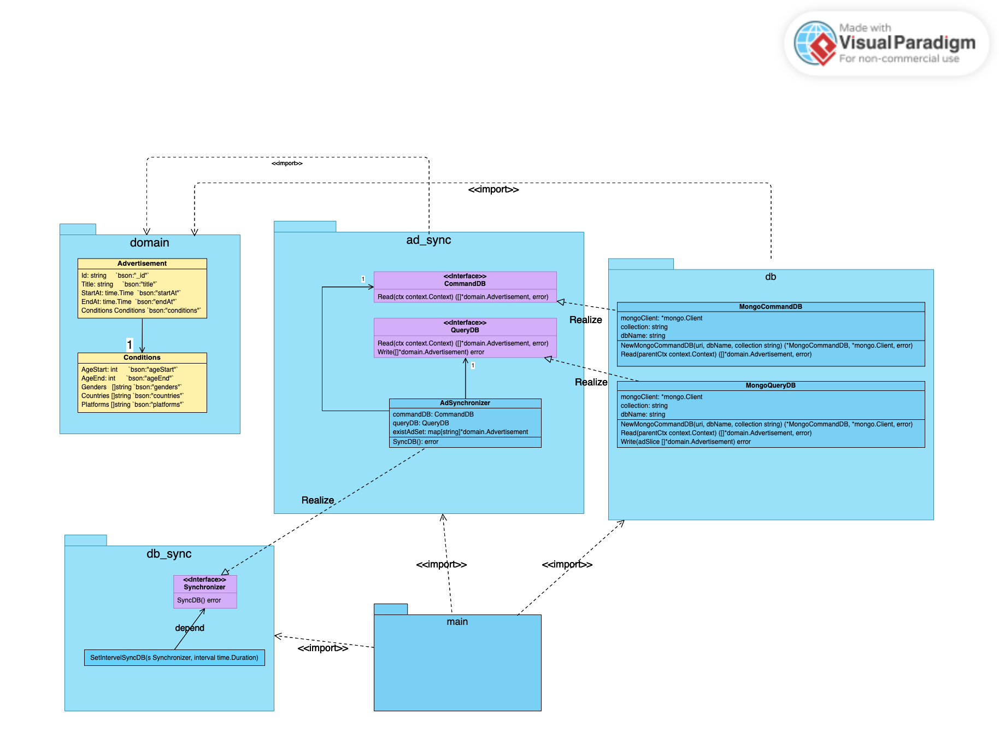

# Data-Synchronizer

## purpose of this repo

- sync the data between DB for read (QueryDB) and DB for write(CommandDB) to maintain conosistency.

## Design

### `domain` package
- definde` Advertisement` and `Conditions` struct used by Syncronizer

### `db_sync` package
* Define interface with SyncDB() method
* define `SetIntervalSyncDB(s Synchronizer, interval time.Duration)` 
    - run Goroutine to sync call Synchronizer to sync DB for every interval

### `ad_sync` package
- define `CommandDB interface` and `QueryDB interface`
    - **we can synchronize any DB or collection as long as implement these interface**
- realize `Synchronizer interface`
    - Define `AdSynchronizer struct` that  use the above `DB interface` to sync Advertisements in CommandDB and QueryDB
    - method `SyncDB()`
        use two Goroutine to query data from CommandDB and QueryDB simultaneously and use ErrorGroup to handle error of Goroutine.

### `db` package
- define `MongoCommandDB` that implement `CommandDB interface` 
- define `MongoQueryDB` that implement `QueryDB interface`

### `main` package
- init` MongoCommandDB`, `MongoQueryDB`
- init `AdSynchronizer` with injection of `MongoCommandDB`, `MongoQueryDB`
- call `SetIntervalSyncDB` with `AdSynchronizer` as parameter to sync data every interval

## Test

### integration test

1. run Mongo test db image `laimark/advertising:test-db` from Docker Hub and bind to 27017 port befor running test. (don't need to set user name and password, it has been set in the image because it's just for test)

2. run 
    ```
    gotestsum --format testname --junitfile junit.xml -- -gcflags=all=-l -p 1 -v -cover ./...
    ```
